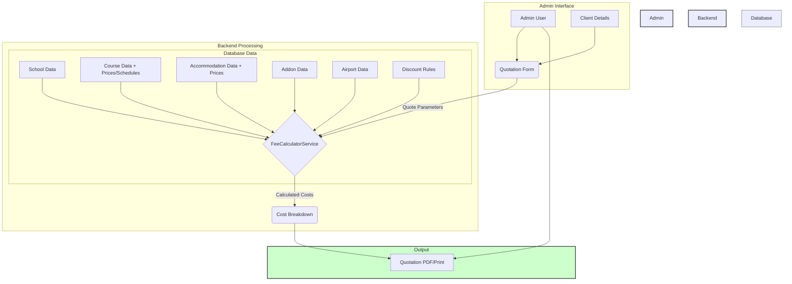

# Bayswater-Laravel Project Explanation

This document provides a detailed explanation of the Laravel project located in `D:\xampp\htdocs\bayswater-laravel`, covering its purpose, features, technical details, and the core quotation calculation logic.

## 1. Project Overview

### Purpose
This project is an administrative web application built using the Laravel framework. Its primary function appears to be managing data and processes for an entity involved in educational services or travel, likely an agency or school group. Key functionalities include managing schools, courses, accommodations, associated costs, discounts, and generating detailed quotations for clients based on complex rules.

### Technology Stack
The project utilizes the following core technologies:

*   **Framework:** Laravel (Version 12.x identified from `composer.json`)
*   **Language:** PHP (Requires version 8.2+)
*   **PDF Generation:** `barryvdh/laravel-dompdf` library is used to generate PDF documents, specifically for quotations.
*   **Development Environment (Potential):**
    *   `laravel/sail` suggests Docker might be used for local development.
    *   `laravel/breeze` indicates that basic authentication scaffolding (login, registration, password reset) was likely set up using this package.
*   **Database:** While not explicitly defined in the analyzed files, Laravel projects typically use relational databases like MySQL, PostgreSQL, or SQLite. Migrations exist in `database/migrations/` defining the schema.
*   **Frontend:** Likely uses Blade templating (`resources/views/`) with potential JavaScript interactions. Tailwind CSS is configured (`tailwind.config.js`, `postcss.config.js`) and Vite (`vite.config.js`) is used for asset bundling.

## 2. Core Features & Capabilities

The application is structured around a protected administrative area.

### Admin Dashboard (`/admin`)
*   Accessible only to authenticated users with administrator privileges (enforced by `auth` and `App\Http\Middleware\IsAdmin` middleware).
*   Serves as the central hub for managing all application data and functionalities.

### Data Management (CRUD Operations)
The admin panel provides interfaces to Create, Read, Update, and Delete (CRUD) various data entities, managed by dedicated controllers (`app/Http/Controllers/Admin/`):

*   **Geographic Data:**
    *   `Countries` (`CountryController`)
    *   `Regions` (`RegionController`)
    *   `Cities` (`CityController`)
*   **Educational Institutions:**
    *   `Schools` (`SchoolController`): Manages school details. Includes AJAX endpoints to fetch school-specific details and associated airports dynamically.
*   **Financials:**
    *   `Currencies` (`CurrencyController`): Manages different currencies used in pricing.
    *   `Discount Rules` (`DiscountRuleController`): Defines rules for applying discounts to quotations based on various criteria.
*   **Offerings:**
    *   `Course Types` (`CourseTypeController`): Categorizes courses.
    *   `Courses` (`CourseController`): Manages course details, including nested resources for:
        *   `Course Prices` (`CoursePriceController`): Defines pricing based on duration (per week).
        *   `Course Schedules` (`CourseScheduleController`): Defines fixed schedules and prices for specific course runs.
    *   `Accommodations` (`AccommodationController`): Manages accommodation options, including nested resources for:
        *   `Accommodation Prices` (`AccommodationPriceController`): Defines pricing based on duration (per week).
    *   `Addons` (`AddonController`): Manages optional extra services (e.g., insurance, courier).
    *   `Airports` (`AirportController`): Manages airport information, including prices for arrival and departure transfers.
*   **Users:**
    *   `Users` (`UserController`): Manages application users (likely administrators and potentially other roles).

### Quotation System
This is a central feature of the application:

*   **Creation Form (`/admin/quotations/create`):** An interface (`resources/views/admin/quotations/create.blade.php`) where administrators select various options (school, course(s), accommodation(s), dates, durations, addons, client details, etc.) to generate a quote.
*   **Calculation Engine (`/admin/quotations/calculate`):** This route triggers the `calculateQuote` or `calculateSplitQuote` method in `App\Services\FeeCalculatorService`. This service performs the complex calculations based on the selected inputs and defined rules (prices, fees, supplements, discounts).
*   **Output Generation:**
    *   **PDF (`/admin/quotations/pdf`):** Uses `App\Http\Controllers\Admin\QuotationPdfController` and `laravel-dompdf` to generate a downloadable PDF of the calculated quotation.
    *   **Print (`/admin/quotations/print`):** Likely triggers a print-friendly view or directly interfaces with browser print functionality for the quotation.

### Settings (`/admin/settings`)
*   Managed by `SettingController`.
*   Allows administrators to configure application-wide settings (e.g., company logo, potentially default values).

### Authentication & Authorization
*   Standard Laravel authentication (login, logout, password management) is implemented, likely via Laravel Breeze (`routes/auth.php`).
*   Profile management (`/profile`) allows authenticated users to update their details.
*   Authorization is enforced using the `IsAdmin` middleware to restrict access to the `/admin` routes.

## 3. The Quotation Calculator (`App\Services\FeeCalculatorService`)

This service class is the core logic engine responsible for calculating the final price of a quotation.

### Role
It takes all the user selections from the quotation form, fetches relevant pricing, fees, and discount rules from the database, performs calculations according to business logic, and returns a detailed cost breakdown.

### Inputs (`quoteParams` array)
The service accepts an array containing details such as:

*   `school_id`
*   `course_id` / `courses` array (for split quotes)
*   `accommodation_id` / `accommodations` array (for split quotes)
*   `course_start_date` / `start_date` (within `courses` array)
*   `course_duration_weeks` / `duration_weeks` (within `courses`/`accommodations` arrays)
*   `accommodation_duration_weeks`
*   `selected_addons` (array of addon IDs and potentially details like weeks)
*   `client_birthday` (to calculate age for specific fees/discounts)
*   `client_nationality_country_id` (for nationality-based discounts)
*   `region_id` (for region-based discounts)
*   `arrival_transfer_airport_id`
*   `departure_transfer_airport_id`
*   `christmas_accommodation` (boolean flag)
*   `christmas_extra_weeks`
*   `christmas_start_date`, `christmas_end_date` (optional overrides)

### Calculation Steps
The `calculateQuote` (single selection) and `calculateSplitQuote` (multiple selections) methods orchestrate the calculation process:

1.  **Reset & Load Data:** Clears previous results and loads essential models (School, Currency, Course(s), Accommodation(s)) and parameters. Validates inputs and returns errors if critical data is missing.
2.  **Calculate School Fees:** Adds standard fees associated with the school (Registration, Bank Charges, Books Fee). Calculates conditional fees (Guardianship/Custodianship for under-18s). Checks for registration fee waivers from discounts.
3.  **Calculate Course Tuition:**
    *   Determines price based on `pricing_type` ('per\_week' or 'fixed\_schedule').
    *   Fetches the correct `CoursePrice` or `CourseSchedule`.
    *   Calculates the base tuition.
    *   Calculates and adds applicable Course Summer Supplements based on date overlaps and school settings (considering waivers based on duration).
4.  **Calculate Accommodation Cost:**
    *   Fetches the correct `AccommodationPrice` based on duration.
    *   Calculates the base accommodation cost.
    *   Adds the Accommodation Placement Fee (checking for waivers).
    *   Calculates and adds applicable Accommodation Summer Supplements based on date overlaps.
    *   Calculates and adds Accommodation Christmas Supplements and costs for extra Christmas weeks based on selections, requirements, date overlaps, and school settings.
5.  **Calculate Addon Costs:** Iterates through `selected_addons`, fetches `Addon` details, and calculates costs based on 'per\_week' or 'one\_time' pricing type.
6.  **Calculate Airport Transfer Costs:** Fetches `Airport` details for selected arrival/departure IDs and adds their respective transfer prices.
7.  **Apply Discounts:** This is a complex step:
    *   Fetches active `DiscountRule` records applicable globally, to the specific school, or to the selected region.
    *   Iterates through rules, ordered by priority.
    *   For each rule, checks if conditions match the current quote (`checkDiscountConditions`): Nationality, Region, Course, Course Type, Accommodation, Accommodation Type, Course/Accommodation Weeks, Start/Booking Date ranges.
    *   If conditions match, calculates the discount amount (`calculateDiscountAmount`) based on the rule's `discount_type` (Percentage, Fixed Amount, Fee Waiver, Fixed Amount Per Week) and what it `applies_to` (Tuition, Accommodation Price, Registration Fee, Accommodation Fee, specific Addon).
    *   Handles combinable vs. non-combinable discounts, ensuring only one non-combinable discount is applied per category (tuition, accommodation, fees, addons).
    *   Adds the calculated discount (or waiver marker) to the breakdown.
8.  **Calculate Final Total:** Sums all positive cost items (tuition, fees, accommodation, addons) and subtracts the total calculated discounts. Ensures the total is not negative.

### Output (`costBreakdown` array)
The service returns a structured array containing:

*   `items` / `course_fees`, `accommodation_fees`, `placement_fees`, `other_fees` (for split quotes): Detailed list of all cost components (name, amount, category).
*   `discounts`: List of applied discounts (name, amount deducted, what it applied to).
*   `subtotals`: Sum of costs per category (tuition, accommodation, fees, addons).
*   `total`: The final calculated price for the client.
*   `currency_code`, `currency_symbol`: Currency details for the quote.
*   `errors`: Any error messages generated during calculation (e.g., missing price, invalid ID).
*   `notes`: Informational notes (e.g., regarding Christmas accommodation).
*   Metadata: `school_name`, `city_name`, `course_name`, `course_duration_weeks`, `course_start_date`.

### Advanced Feature: Split Quotes
The `calculateSplitQuote` method allows generating quotes that include multiple distinct course and/or accommodation selections within the same quotation, calculating fees and supplements for each individually before summing them up and applying overall discounts.

## 4. Data Flow Diagram (Quotation Process)

This diagram illustrates how an Admin User interacts with the Quotation Form, providing Client Details and selecting options. These parameters are sent to the `FeeCalculatorService`, which pulls necessary data from the Database (Schools, Courses, Accommodations, Addons, Airports, Discounts). The service calculates the `Cost Breakdown`, which is then used to generate the final Quotation PDF or print view for the Admin User.